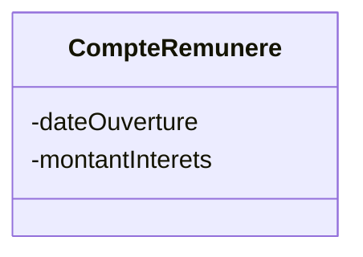

<style>
  .reveal p {
    text-align: left;
  }
  .reveal ul {
    display: block;
  }
  .reveal ol {
    display: block;
  }
  .size {
  font-size: 28px;
  }
  .sizeXXX {
  font-size: xxx-large;
  }
</style>

# Héritage

---

## Une nouvelle situation dans la banque
On désire pouvoir ajouter des informations supplémentaires sur les seuls comptes rémunérés :  
- la date d’ouverture
- le montant des intérêts.

---

## On crée une nouvelle classe




---

## Création d'une relation d’héritage entre les deux classes


---


---

## Code de la class CompteRemunere (classe dérivée)
```csharp
// les : indiquent que CompteRemunere hérite de la class Compte
class CompteRemunere : Compte
    {   
        private DateTime dateOuverture;    
        private double montantInterets;
        ⋮
```

---

## Le constructeur de la classe dérivée
<div class="size">

```csharp
class CompteRemunere : Compte
  {
      ⋮
      // Notez le mot base suivi du constructeur de la classe parente
      public CompteRemunere(int numero, string nom, float solde, float decouvertAutorise, DateTime d,
          double montant) : base(numero, nom, solde, decouvertAutorise)
      {
          this.dateOuverture = d;
          this.montantInterets = montant;
      }
```

</div>

---

## Les services de la classe 
La classe fille accède à tous les services <mark>publics</mark> de la classe mère
```csharp
CompteRemunere cr;
cr = new CompteRemunere("Durand", 123, …);
// Appel de la méthode getNom() de la class Compte 
// depuis la class CompteRemunere
string nom = cr.getNom();
```

---

# ⚠️
Une classe héritée n’a pas accès aux  
<mark>champs et méthodes privés de la classe parente.</mark> 

---

<section>

## Heritage et redéfinition de service

---

## Redéfinition de service (1/2)
Par exemple ToString de la classe parente :

```csharp
Compte c;
c = new Compte(12, 'toto', 1000, 500);
Console.WriteLine(c.ToString());
```


Ne retourne pas les informations du compte rémunéré :  


---

## Redéfinition de service (2/2)
Redéfinition de la méthode ToString de la classe <mark>CompteRemunere</mark> :


```csharp

//Override signifie réécriture dans une classe descendante
public override string ToString()
 {
    string s = "";
    // L’objet base fait référence à l’objet de la classe mère
    s = base.ToString();
    s += "Date {this.dateOuverture} interets : {this.montantInterets}";
    return s;
 }
```

</section>

---

<section>

## Mise en oeuvre

---

## 1/2
On pourra écrire :

```csharp

Compte c,c1,c2;
c = new Compte(12345, 'toto', 1000, -500);
c1 = new Compte(45657, 'titi', 2000, -1000);
c2 = new CompteRemunere(12654, 'tintin', 5000, -500, new DateTime(2012,10,9), 200);
// C2 bénéficie de la méthode crediter de la classe Compte
c2.crediter(1200);
```

Des variables de type <mark>Compte</mark> peuvent construire des objets de type <mark>CompteRemunere</mark> !!

---

## 2/2  
En programmation objet, tout « objet » a deux types :
1. Un type dit statique, le type de la variable
2. Un type dynamique, le type à la construction

En général, le type dit statique est le même que le type dynamique.  
Dans les mécanismes d’héritages, il en est souvent autrement ; le type statique est celui d’une classe mère et le type dynamique celui d’une classe fille.


</section>

---

<section>

## Méthodes virtuelles 

---

## 1/3
<div class="size">

Reprenons en détail l’exemple précédent :
```csharp
Compte c,c1,c2;
c = new Compte(12345, 'toto', 1000, -500);
c1 = new Compte(45657, 'titi', 2000, -1000);
c2 = new CompteRemunere(12654, 'tintin', 5000, -500, new DateTime(2012,10,9), 200);
c2.crediter(1200);
```
</div>
Imaginons que pour un compte rémunéré le plafond des versements soit limité à 1000 euros par opération.


---

## 2/3
Nous devons alors modifier le comportement de la méthode crediter pour la seule classe CompteRemunere.  
Le code est simple :
```csharp
public void crediter(double montant)
    {
        if (montant<=1000) {
            base.crediter(montant);
        }
    }
```

---

Maintenant regardons ce qui se passe à l’appel de la méthode
<div class="size">

```csharp
Compte c;
c2 = new CompteRemunere(12654, 'tintin', 5000, -500, new DateTime(2012,10,9), 200);
c2.crediter(1200);
ConsoleWriteLine(c2.ToString());
```
</div>

On obtient :  
 


Le compte a été crédité : c’est la méthode de l’objet statique qui a été exécutée !!

---

## 3/3
<div class="size">

Pour modifier ce comportement par défaut, il faut :
1. Dans la classe mère :

```csharp

//Indiquer que la méthode est virtual
public virtual void crediter(double montant)
 {
   this.solde += montant;
 }
```

2. Dans la (ou les) classes descendantes :

```csharp

//Préciser qu'elle est redéfinit
public override void crediter(double montant)
{
if (montant<=1000) {
base.crediter(montant);
}
}
```

</div>

---

3. Le résultat est celui escompté :

   

Comme le montant créditer est supérieur à 1000 pour le compte rémunéré, l'opération n'a pas lieu.
</section>

---
<section>

## Utilisation dans une classe conteneur 

---

## 1/2


---

## La classe Banque contient une liste de Compte :
<div class="size">

```csharp
Compte c,c1,c2;
c = new Compte(12345, 'toto', 1000, -500);
c1 = new Compte(45657, 'titi', 2000, -1000);
c2 = new CompteRemunere(12654, 'tintin', 5000, -500, new DateTime(2012,10,9), 200);
Banque b = new Banque();
b.ajouterClient(c);
b.ajouterClient(c1);
b.ajouterClient(c2);
foreach (Compte compte in b.getLesComptes()
{
    ConsoleWriteLine(compte.ToString());
}    
```
</div>
Chaque compte sera traité comme son type dynamique (Compte ou CompteRemunere).

</section>

---

# ↩️

#### [Start over]({{ "/index" | url }})