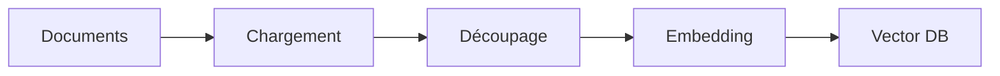
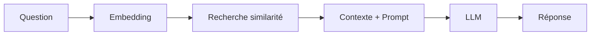

<style>
  .reveal p {
    text-align: left;
  }
  .reveal ul {
    display: block;
  }
  .reveal ol {
    display: block;
  }
  .size {
  font-size: 28px;
  }
  .sizeXXX {
  font-size: xxx-large;
}
</style>

# Cours : RAG Local avec Ollama, LangChain et LangGraph

---

## Table des matières
1. [Introduction au RAG](#introduction-au-rag)
2. [Architecture Technique](#2-architecture-technique)
3. [LangChain vs LangGraph](#3-langchain-vs-langgraph)
4. [Configuration de l'environnement](#4-configuration-de-lenvironnement)
5. [Implémentation pratique](#5-implémentation-pratique)
6. [Optimisations avancées](#6-optimisations-avancées)
7. [Cas d'usage et limites](#7-cas-dusage-et-limites)

---
<section>

## 1. Introduction au RAG

---

### Qu'est-ce que le RAG ?

Le **Retrieval-Augmented Generation (RAG)** est une architecture qui combine :
- La **recherche d'information** (retrieval) dans une base documentaire
- La **génération de texte** par un modèle de langage (LLM)

Cette technique enrichit les connaissances d'un LLM avec des données privées ou récentes **sans nécessiter de réentraînement coûteux**.

---

### Les 4 bénéfices clés

- **Précision accrue :** Réduit les hallucinations en ancrant les réponses dans des sources documentées
- **Actualité des données :** Exploite des documents créés il y a quelques minutes
- **Confidentialité totale :** En mode local, vos données ne quittent jamais votre infrastructure
- **Économie :** Pas de réentraînement ni d'API payante nécessaire

---

### Cas d'usage concrets

- Documentation technique interne d'entreprise
- Analyse de rapports juridiques ou médicaux
- Assistant personnel sur vos notes/emails
- Chatbot client basé sur votre base de connaissances
</section>

---
<section>

## 2. Architecture Technique

Le pipeline RAG se décompose en deux phases distinctes.

---

### Phase A : Indexation (Préparation des données)

Cette phase s'exécute **une seule fois** ou lors de mises à jour de la base documentaire.


---
#### Étapes détaillées

1. **Chargement (Load)**
   - Extraction du contenu textuel de diverses sources
   - Formats supportés : PDF, DOCX, TXT, HTML, Markdown, CSV
   - Outils : PyPDFLoader, UnstructuredLoader, WebBaseLoader

---


2. **Découpage (Split)**
   - Division du texte en segments gérables (chunks)
   - Taille typique : 500-1000 tokens par chunk
   - Chevauchement (overlap) : 50-200 tokens pour conserver le contexte
   - Stratégies : RecursiveCharacterTextSplitter, SemanticChunker

---

3. **Embedding (Vectorisation)**
   - Conversion des chunks en vecteurs mathématiques (ex: 768 dimensions)
   - Modèle local : `nomic-embed-text` via Ollama
   - Alternative : `mxbai-embed-large`, `all-MiniLM-L6-v2`

---

4. **Stockage (Store)**
   - Sauvegarde des vecteurs dans une base vectorielle
   - Solutions locales : **ChromaDB**, FAISS, Qdrant
   - Indexation pour recherche rapide par similarité cosinus
   
---
### Phase B : Interrogation (Exécution temps réel)

Cette phase s'exécute **à chaque question** de l'utilisateur.


---
#### Étapes détaillées

1. **Vectorisation de la question**
   - La requête utilisateur est convertie en vecteur (même modèle d'embedding)

2. **Recherche (Retrieve)**
   - Calcul de similarité cosinus entre le vecteur question et les vecteurs stockés
   - Récupération des top-k chunks les plus pertinents (k = 3-5 typiquement)

---

3. **Augmentation du prompt**
   - Injection des chunks récupérés dans le contexte du LLM
   - Format : `Contexte: [documents]\n\nQuestion: [question]\n\nRéponds en te basant uniquement sur le contexte.`

4. **Génération**
   - Le LLM (ex: Llama 3) génère la réponse finale
   - Paramètres clés : temperature (0.1-0.3 pour plus de précision), max_tokens
</section>

---
<section>

## 3. LangChain vs LangGraph

---

### Comparaison technique
<div class="size">

| Critère                    | LangChain                        | LangGraph                     |
|:---------------------------|:---------------------------------|:------------------------------|
| **Paradigme**              | Chaînes séquentielles (LCEL)     | Graphes d'états avec cycles   |
| **Flux de contrôle**       | Linéaire A → B → C               | Conditionnel avec boucles     |
| **Logique**                | Déterministe                     | Agentique (prise de décision) |
| **Complexité**             | Simple, rapide à mettre en place | Plus complexe, plus puissant  |
| **Auto-correction**        | Non                              | Oui (vérification pertinence) |
| **Cas d'usage**            | RAG classique, Q&A simple        | RAG adaptatif, multi-requêtes |
| **Courbe d'apprentissage** | Faible                           | Moyenne                       |

</div>

---

### Quand utiliser LangChain ?

- RAG simple sur documentation statique
- Prototype rapide
- Performance critique (moins d'overhead)
- Flux prédictible sans cas limites

---

### Quand utiliser LangGraph ?

- Besoin de **vérification de pertinence** avant génération
- **Reformulation automatique** des requêtes ambiguës
- **Fusion multi-sources** (recherche web + docs internes)
- Systèmes avec **mémoire conversationnelle** complexe
- Workflows avec **retry logic** ou validation

---

### Exemple de flux LangGraph

```python
# Graphe avec vérification de pertinence
1. Retrieve documents
2. Grade relevance (LLM judge)
   - Si pertinent → Generate
   - Si non pertinent → Reformulate query → Retrieve again
3. Generate answer
4. Hallucination check
   - Si hallucination détectée → Regenerate
```
</section>

---
<section>

## 4. Configuration de l'environnement

---

### Prérequis système

- **OS :** Linux, macOS, Windows (WSL2 recommandé)
- **RAM :** Minimum 16 GB (32 GB recommandé pour modèles 7B+)
- **GPU :** Optionnel mais accélère significativement (NVIDIA avec CUDA)
- **Espace disque :** 10-20 GB pour les modèles

---

### Installation d'Ollama

```bash
# Linux/macOS
curl -fsSL https://ollama.com/install.sh | sh

# Windows
# Télécharger depuis https://ollama.com/download
```

Vérifier l'installation :
```bash
ollama --version
```
---

### Téléchargement des modèles

```bash
# Modèle de génération (choisir selon votre RAM)
ollama pull llama3.2:3b       # 2 GB - Rapide, moins précis
ollama pull llama3:8b          # 4.7 GB - Équilibré (recommandé)
ollama pull llama3:70b         # 40 GB - Très précis, nécessite GPU

# Modèle d'embedding
ollama pull nomic-embed-text   # 274 MB - Excellent rapport qualité/taille
ollama pull mxbai-embed-large  # 669 MB - Plus précis
```

Tester un modèle :
```bash
ollama run llama3:8b "Explique le RAG en une phrase"
```
---

### Environnement Python

```bash
# Créer un environnement virtuel
python -m venv venv
source venv/bin/activate  # Linux/macOS
# venv\Scripts\activate   # Windows

# Installer les dépendances
pip install langchain langchain-community langchain-ollama
pip install chromadb        # Base vectorielle
pip install pypdf           # Pour les PDF
pip install beautifulsoup4  # Pour le web scraping
pip install tiktoken        # Comptage de tokens

# Pour LangGraph (optionnel)
pip install langgraph
```
---

### Configuration ChromaDB

```python
from langchain_community.vectorstores import Chroma
from langchain_ollama import OllamaEmbeddings

# Initialisation
embeddings = OllamaEmbeddings(model="nomic-embed-text")
vectorstore = Chroma(
    persist_directory="./chroma_db",  # Persistance locale
    embedding_function=embeddings
)
```
</section>

---
<section>

## 5. Implémentation pratique

---

### Exemple complet : RAG avec LangChain

```python
from langchain_community.document_loaders import PyPDFLoader
from langchain.text_splitter import RecursiveCharacterTextSplitter
from langchain_community.vectorstores import Chroma
from langchain_ollama import OllamaEmbeddings, ChatOllama
from langchain.chains import RetrievalQA

# 1. CHARGEMENT
loader = PyPDFLoader("document.pdf")
documents = loader.load()

# 2. DÉCOUPAGE
text_splitter = RecursiveCharacterTextSplitter(
    chunk_size=1000,
    chunk_overlap=200,
    separators=["\n\n", "\n", " ", ""]
)
chunks = text_splitter.split_documents(documents)

# 3. EMBEDDING + STOCKAGE
embeddings = OllamaEmbeddings(model="nomic-embed-text")
vectorstore = Chroma.from_documents(
    documents=chunks,
    embedding=embeddings,
    persist_directory="./db"
)

# 4. CONFIGURATION DU RETRIEVER
retriever = vectorstore.as_retriever(
    search_type="similarity",
    search_kwargs={"k": 4}  # Top 4 chunks
)

# 5. CHAÎNE RAG
llm = ChatOllama(model="llama3:8b", temperature=0.2)
qa_chain = RetrievalQA.from_chain_type(
    llm=llm,
    chain_type="stuff",  # Injecte tous les docs dans le prompt
    retriever=retriever,
    return_source_documents=True  # Retourne les sources
)

# 6. INTERROGATION
query = "Quels sont les principaux risques mentionnés ?"
result = qa_chain({"query": query})

print(result["result"])
print("\nSources :")
for doc in result["source_documents"]:
    print(f"- Page {doc.metadata['page']}: {doc.page_content[:100]}...")
```
---

### Exemple avancé : RAG avec LangGraph

```python
from langgraph.graph import StateGraph, END
from typing import TypedDict, List

# Définition de l'état
class GraphState(TypedDict):
    question: str
    documents: List[str]
    generation: str
    is_relevant: bool

# Nœud 1 : Récupération
def retrieve(state):
    docs = retriever.get_relevant_documents(state["question"])
    return {"documents": docs}

# Nœud 2 : Vérification pertinence
def grade_documents(state):
    # Utilise un LLM pour juger la pertinence
    prompt = f"Les documents sont-ils pertinents pour : {state['question']}?"
    response = llm.invoke(prompt)
    return {"is_relevant": "oui" in response.lower()}

# Nœud 3 : Génération
def generate(state):
    context = "\n".join([d.page_content for d in state["documents"]])
    prompt = f"Contexte: {context}\n\nQuestion: {state['question']}"
    answer = llm.invoke(prompt)
    return {"generation": answer}

# Construction du graphe
workflow = StateGraph(GraphState)
workflow.add_node("retrieve", retrieve)
workflow.add_node("grade", grade_documents)
workflow.add_node("generate", generate)

# Définition des arêtes conditionnelles
workflow.add_edge("retrieve", "grade")
workflow.add_conditional_edges(
    "grade",
    lambda x: "generate" if x["is_relevant"] else "retrieve",
    {"generate": "generate", "retrieve": "retrieve"}
)
workflow.add_edge("generate", END)

# Compilation
app = workflow.compile()

# Exécution
result = app.invoke({"question": "Quelle est la procédure d'évacuation ?"})
print(result["generation"])
```
</section>

---
<section>

## 6. Optimisations avancées

---

### Amélioration de la recherche

**Hybrid Search (Combinaison dense + sparse)**
```python
from langchain.retrievers import EnsembleRetriever
from langchain_community.retrievers import BM25Retriever

# Dense retriever (vectoriel)
dense_retriever = vectorstore.as_retriever()

# Sparse retriever (BM25 - recherche par mots-clés)
bm25_retriever = BM25Retriever.from_documents(chunks)

# Combinaison (50% dense, 50% sparse)
ensemble_retriever = EnsembleRetriever(
    retrievers=[dense_retriever, bm25_retriever],
    weights=[0.5, 0.5]
)
```
---

**Re-ranking des résultats**
```python
from langchain.retrievers import ContextualCompressionRetriever
from langchain.retrievers.document_compressors import CohereRerank

compressor = CohereRerank(model="rerank-english-v2.0")
compression_retriever = ContextualCompressionRetriever(
    base_compressor=compressor,
    base_retriever=retriever
)
```
---

### Stratégies de chunking avancées

**Semantic Chunking (découpage par sens)**
```python
from langchain_experimental.text_splitter import SemanticChunker

semantic_splitter = SemanticChunker(
    embeddings=embeddings,
    breakpoint_threshold_type="percentile",  # Coupe aux ruptures sémantiques
    breakpoint_threshold_amount=0.8
)
```
---

**Parent-Child Chunking**
```python
# Stocke de petits chunks pour la recherche
# Mais retourne le contexte parent élargi lors de la génération
from langchain.retrievers import ParentDocumentRetriever
from langchain.storage import InMemoryStore

store = InMemoryStore()
child_splitter = RecursiveCharacterTextSplitter(chunk_size=400)
parent_splitter = RecursiveCharacterTextSplitter(chunk_size=2000)

retriever = ParentDocumentRetriever(
    vectorstore=vectorstore,
    docstore=store,
    child_splitter=child_splitter,
    parent_splitter=parent_splitter,
)
```
---

### Optimisation des prompts

**Prompt engineering pour RAG**
```python
template = """Tu es un assistant technique expert. Réponds UNIQUEMENT en te basant sur le contexte fourni.
Si l'information n'est pas dans le contexte, dis "Je ne trouve pas cette information dans les documents fournis."

Contexte:
{context}

Question: {question}

Instructions:
1. Cite les sources (numéro de page si disponible)
2. Sois concis mais complet
3. Structure ta réponse avec des bullet points si nécessaire

Réponse:"""
```
---

### Mise en cache pour performance

```python
# Cache des embeddings (évite de recalculer)
from langchain.cache import InMemoryCache
from langchain.globals import set_llm_cache

set_llm_cache(InMemoryCache())

# Cache des résultats de recherche
from functools import lru_cache

@lru_cache(maxsize=100)
def cached_retrieval(query: str):
    return retriever.get_relevant_documents(query)
```
</section>

---
<section>

## 7. Cas d'usage et limites
---

### Cas d'usage recommandés

<div class="size">

✅ **Documentation technique interne**
- Manuels d'utilisation
- Procédures opérationnelles
- Bases de connaissances IT

✅ **Analyse de documents juridiques**
- Contrats
- Jurisprudence
- Conformité réglementaire
</div>

---
<div class="size">

✅ **Recherche académique**
- Articles scientifiques
- Thèses
- Littérature grise

✅ **Support client automatisé**
- FAQ dynamique
- Troubleshooting guidé
- Onboarding personnalisé

</div>

---

### Limites et considérations

<div class="size">

❌ **Limites techniques**
- **Taille du contexte :** LLMs locaux limités à 4-8k tokens (vs 100k+ pour GPT-4)
- **Précision :** Modèles 7B moins précis que GPT-4 sur raisonnements complexes
- **Vitesse :** 5-20 tokens/s sur CPU (vs 50-100 avec GPU)
- **Multilingue :** Performances variables selon la langue

❌ **Limites conceptuelles**
- Pas de raisonnement mathématique complexe
- Difficultés avec les graphiques/tableaux (sans multimodal)
- Pas d'accès temps réel à internet (sauf si intégré explicitement)
- Sensible à la qualité du chunking
</div>

---

### Métriques d'évaluation

**Mesurer la performance de votre RAG :**

```python
from ragas import evaluate
from ragas.metrics import faithfulness, answer_relevancy, context_recall

# Dataset de test
test_questions = [
    {"question": "...", "ground_truth": "...", "contexts": [...]}
]

# Évaluation
results = evaluate(
    dataset=test_questions,
    metrics=[faithfulness, answer_relevancy, context_recall]
)

print(results)
# faithfulness: 0.85 (réponse fidèle au contexte)
# answer_relevancy: 0.92 (pertinence de la réponse)
# context_recall: 0.78 (contexte contient la réponse)
```

---

## Ressources complémentaires

---

### Documentation officielle
- [LangChain Docs](https://python.langchain.com/)
- [LangGraph Guide](https://langchain-ai.github.io/langgraph/)
- [Ollama Models](https://ollama.com/library)
- [ChromaDB Docs](https://docs.trychroma.com/)
---

### Projets open-source inspirants
- **PrivateGPT :** RAG local clé en main
- **LocalGPT :** Alternative avec QDrant
- **Quivr :** Interface web pour RAG personnel
---

### Articles de recherche
- *Retrieval-Augmented Generation for Knowledge-Intensive NLP Tasks* (Lewis et al., 2020)
- *Lost in the Middle* (Liu et al., 2023) - Sur l'ordre des documents récupérés
</section>

---
<section>

## Conclusion

Le RAG local avec Ollama offre une alternative souveraine et performante aux solutions cloud. La maîtrise de LangChain permet de couvrir 80% des cas d'usage, tandis que LangGraph débloque les 20% restants nécessitant de l'intelligence agentique.

---

**Prochaines étapes recommandées :**
1. Implémenter un RAG simple sur vos propres documents
2. Mesurer les performances avec RAGAS
3. Itérer sur le chunking et le prompt engineering
4. Explorer LangGraph pour des workflows avancés

---

**Points clés à retenir :**
- La qualité du RAG dépend à 70% de la qualité du chunking et des embeddings
- Toujours retourner les sources pour vérification humaine
- Le local nécessite des compromis performance/précision
- L'évaluation continue est cruciale pour maintenir la qualité

</section>

---

# ↩️

#### [Start over]({{ "/index" | url }})